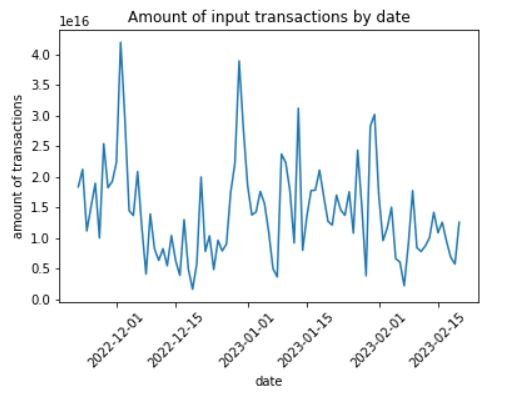
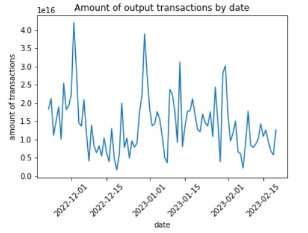
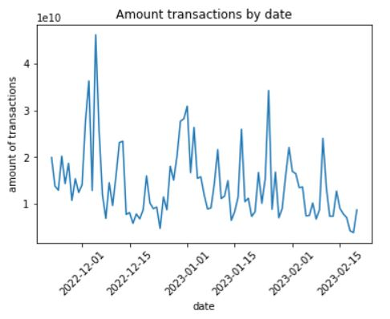

<h1 align=center> Bitcoin Cash Challenge - Astrafy</h1>

Bitcoin Cash is a cryptocurrency that allows more bytes to be included in each block relative to its common ancestor Bitcoin. 
There is a public dataset on BigQuery that contains the blockchain data in their entirety (dataset ID: <a href="https://console.cloud.google.com/marketplace/product/bitcoin-cash/crypto-bitcoin-cash">bigquery-public-data.crypto_bitcoin_cash</a>) with data pre-processed to be human-friendly and to support common use cases such as auditing, investigating, and researching the economic and financial properties of the system.

<h2>Project Overview</h2>

In this project, we will create  staging table from the raw table "transactions" that only selects the last three months of data from this raw table. 
Then we will, materialize a datamart table that gives the current balance for all addresses and exclude addresses that had at least one transaction on Coinbase.
Finally we will display a graph of daily transactions. 
We will use dbt cloud to materialize the two tables aforementioned and a Google colab notebook using Python to plot the chart of daily transactions from last 3 months. 


<h2>Prerequisites</h2>

- A Google Cloud account with access to BigQuery and Cloud Storage.
- A dbt Cloud account.


<h2>Getting Started</h2>

To get started with this project, follow these steps:

1. Create a new Google Cloud project.
2. Configure your Google Cloud and dbt Cloud
3. Use dbt Cloud to materialize the staging and datamart tables.
4. Create a notebook to plot the transactions of last 3 months.

<h3>dbt</h3>
To Run staging table model on dbt Cloud

```
dbt run --models STG_bitcoin_cash_transactions_3M
```

To Run datamart model
```
dbt run --models DTM_bitcoin_cash_transactions_3M
```

<h3>Drizly's SQLFluff</h3>
<a href="https://github.com/sqlfluff/">SQLFluff</a> is a SQL linter and auto-formatter that can help you catch errors and enforce consistent style in your SQL code. It supports a variety of SQL dialects and can be easily integrated into your workflow using Github Actions.

</br>

To use SQLFluff on Github Actions, you need to create a new workflow file in your repository like this one <a href="https://github.com/clementmariebrisson/bitcoin-cash-challenge/tree/main/.github/workflows/lint_sqlfluff.yml">lint_sqlfluff.yml</a>

</br>

This workflow uses the **sqlfluff** package to lint any SQL files in your **/models** directory that have been added or modified in the latest push or pull request on the main branch. It also uses the **yuzutech/annotations-action** to annotate your Github pull request with any lint errors found by SQLFluff.

To use this workflow in your own repository, you need to make sure to update the file paths and any other parameters such as *--dialect bigquery* to match your specific project.

<h3>Terraform</h3>
Terraform is an open-source infrastructure as code (IaC) tool that allows you to manage your infrastructure, with the possibility to works with many popular cloud providers, including AWS, Azure, Google Cloud Platform. If you want to set up a Terraform based infrastucture you can follow these 2 steps:

1. <a href="https://phoenixnap.com/kb/how-to-install-terraform">Install Terraform</a>
2. <a href="https://developer.hashicorp.com/terraform/tutorials/gcp-get-started">Terraform - Get Started with GCP</a>
3. Add Terraform to your path
4. Create a terraform.tfvar file and replace GCP project ID and the path to your key file:

```
project                  = "<PROJECT_ID>"
credentials_file         = "<FILE>"
```

5. GO to terraform-docker-container and execute 
```./setup.bash```
6. Anytime you modify your configuration execute ```terraform apply```

Once you are finished with Terraform, don't forget to terminate resources by executing ```terraform destroy```

<h2>The amount of transactions</h2>

As we are dealing with transactions, we have some incomes and somes outcomes. This is why I decided to plot 3 graphs : incomes, outcomes and the global balance.







<h2>Getting Started</h2>


<h2>References</h2>

<ul>
  <li><a href="https://console.cloud.google.com/marketplace/product/bitcoin-cash/crypto-bitcoin-cash">BigQuery 
      Public Data: Bitcoin Cash Blockchain</a></li>
  <li><a href="https://cloud.google.com/">Google Cloud</a></li>
  <li><a href="https://docs.getdbt.com/">DBT Documentation</a></li>
  <li><a href="https://colab.research.google.com/notebooks/intro.ipynb">Google Colab</a></li>
  <li><a href="https://github.com/sqlfluff/sqlfluff-github-actions/tree/main/menu_of_workflows/drizly">Drizly's SQLFluff</a></li>
  <li><a href="https://phoenixnap.com/kb/how-to-install-terraform">Install Terraform</a></li>
  <li><a href="https://developer.hashicorp.com/terraform/tutorials/gcp-get-started">Terraform - Get Started with GCP</a></li>
</ul>